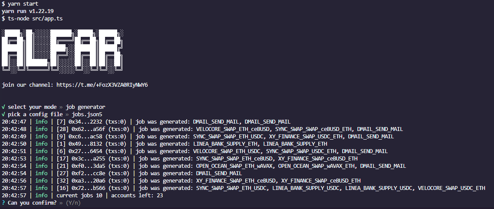

[](https://git.io/typing-svg)

Soft designed to manage Linea accounts by simulating user activity through random transactions.
## Overview

***Please read the instructions carefully to understand how soft works before running it.***

Main features:
- Simple setup
- Interaction with various services, such as syncswap, velocore, dmail, open ocean, xy finance, pancake, woofi, linea bank etc.
- Dynamic gas limit before each transaction (that is, you can change the limit directly during the execution of the program)
- Selection of services for work
- Ability to run in several terminals with different settings/accounts
- Collection of information from the blockchain about accounts (token balances and number of transactions)
- Encryption of private keys, proxies, addresses with a password for using soft on the server
- TRUE RANDOMIZATION. One of the examples: swap wbtc for eth on syncswap -> supply wbtc to linea bank -> send a message to dmail -> redeem wbtc from linea bank -> swap wbtc for eth on open ocean. and it's all automatic. now more than 100 different paths are available in 8 services, with more to come

***Important: linea mainnet can sometimes throw errors and stop working suddenly. Please do not make large volumes with the soft, it is designed to increase the number of transactions. Adding $20 on an account and setting the working volume of 1-7% is ok***

What will be added next:
- Possibility of deposit in linea
- Proxy connection
- Separate mode for returning tokens from all services and swapping excess tokens in eth (in case of errors in the main mode)
- Even more contracts

## How it works

Main mode creates `task` for each account consisting of `steps`, which represent a list of `transactions`:
1. One step is consists of transactions sent by real users within 1-2 minutes. E.g., [approve -> swap]. Here, 1 step is 2 transactions. Steps can currently consist of 1-3 transactions.
2. One task consists of steps that can be executed by real users within hours/days. E.g., [swap ETH to USDC] --> [approve USDC -> add USDC to liquidity pool] --> [remove liquidity] --> [approve USDC -> swap to ETH]. Here, 1 task = 4 steps = 6 transactions. Each task concludes by returning all tokens/liquidity to ETH.

Check for updates here: [alfar](https://t.me/+FozX3VZA0RIyNWY6)

Donate: `0xeb3F3e28F5c83FCaF28ccFC08429cCDD58Fd571D`



<details>
    <summary> Click here to see all current possible tasks (if all providers are turned on) </summary>

    Swap eth -> token -> eth: 55
    OPEN_OCEAN_SWAP_ETH_IUSD -> OPEN_OCEAN_SWAP_IUSD_ETH
    OPEN_OCEAN_SWAP_ETH_IZI -> OPEN_OCEAN_SWAP_IZI_ETH
    OPEN_OCEAN_SWAP_ETH_USDC -> OPEN_OCEAN_SWAP_USDC_ETH
    OPEN_OCEAN_SWAP_ETH_USDC -> PANCAKE_SWAP_USDC_ETH
    OPEN_OCEAN_SWAP_ETH_USDC -> SYNCSWAP_SWAP_USDC_ETH
    OPEN_OCEAN_SWAP_ETH_USDC -> VELOCORE_SWAP_USDC_ETH
    OPEN_OCEAN_SWAP_ETH_USDC -> WOOFI_SWAP_USDC_ETH
    OPEN_OCEAN_SWAP_ETH_USDC -> XY_FINANCE_SWAP_USDC_ETH
    OPEN_OCEAN_SWAP_ETH_WBTC -> OPEN_OCEAN_SWAP_WBTC_ETH
    OPEN_OCEAN_SWAP_ETH_WBTC -> SYNCSWAP_SWAP_WBTC_ETH
    OPEN_OCEAN_SWAP_ETH_wAVAX -> OPEN_OCEAN_SWAP_wAVAX_ETH
    OPEN_OCEAN_SWAP_ETH_wBNB -> OPEN_OCEAN_SWAP_wBNB_ETH
    OPEN_OCEAN_SWAP_ETH_wMATIC -> OPEN_OCEAN_SWAP_wMATIC_ETH
    PANCAKE_SWAP_ETH_USDC -> OPEN_OCEAN_SWAP_USDC_ETH
    PANCAKE_SWAP_ETH_USDC -> PANCAKE_SWAP_USDC_ETH
    PANCAKE_SWAP_ETH_USDC -> SYNCSWAP_SWAP_USDC_ETH
    PANCAKE_SWAP_ETH_USDC -> VELOCORE_SWAP_USDC_ETH
    PANCAKE_SWAP_ETH_USDC -> WOOFI_SWAP_USDC_ETH
    PANCAKE_SWAP_ETH_USDC -> XY_FINANCE_SWAP_USDC_ETH
    SYNCSWAP_SWAP_ETH_USDC -> OPEN_OCEAN_SWAP_USDC_ETH
    SYNCSWAP_SWAP_ETH_USDC -> PANCAKE_SWAP_USDC_ETH
    SYNCSWAP_SWAP_ETH_USDC -> SYNCSWAP_SWAP_USDC_ETH
    SYNCSWAP_SWAP_ETH_USDC -> VELOCORE_SWAP_USDC_ETH
    SYNCSWAP_SWAP_ETH_USDC -> WOOFI_SWAP_USDC_ETH
    SYNCSWAP_SWAP_ETH_USDC -> XY_FINANCE_SWAP_USDC_ETH
    SYNCSWAP_SWAP_ETH_WBTC -> OPEN_OCEAN_SWAP_WBTC_ETH
    SYNCSWAP_SWAP_ETH_WBTC -> SYNCSWAP_SWAP_WBTC_ETH
    SYNCSWAP_SWAP_ETH_ceBUSD -> SYNCSWAP_SWAP_ceBUSD_ETH
    SYNCSWAP_SWAP_ETH_ceBUSD -> VELOCORE_SWAP_ceBUSD_ETH
    SYNCSWAP_SWAP_ETH_ceBUSD -> XY_FINANCE_SWAP_ceBUSD_ETH
    VELOCORE_SWAP_ETH_USDC -> OPEN_OCEAN_SWAP_USDC_ETH
    VELOCORE_SWAP_ETH_USDC -> PANCAKE_SWAP_USDC_ETH
    VELOCORE_SWAP_ETH_USDC -> SYNCSWAP_SWAP_USDC_ETH
    VELOCORE_SWAP_ETH_USDC -> VELOCORE_SWAP_USDC_ETH
    VELOCORE_SWAP_ETH_USDC -> WOOFI_SWAP_USDC_ETH
    VELOCORE_SWAP_ETH_USDC -> XY_FINANCE_SWAP_USDC_ETH
    VELOCORE_SWAP_ETH_ceBUSD -> SYNCSWAP_SWAP_ceBUSD_ETH
    VELOCORE_SWAP_ETH_ceBUSD -> VELOCORE_SWAP_ceBUSD_ETH
    VELOCORE_SWAP_ETH_ceBUSD -> XY_FINANCE_SWAP_ceBUSD_ETH
    WOOFI_SWAP_ETH_USDC -> OPEN_OCEAN_SWAP_USDC_ETH
    WOOFI_SWAP_ETH_USDC -> PANCAKE_SWAP_USDC_ETH
    WOOFI_SWAP_ETH_USDC -> SYNCSWAP_SWAP_USDC_ETH
    WOOFI_SWAP_ETH_USDC -> VELOCORE_SWAP_USDC_ETH
    WOOFI_SWAP_ETH_USDC -> WOOFI_SWAP_USDC_ETH
    WOOFI_SWAP_ETH_USDC -> XY_FINANCE_SWAP_USDC_ETH
    XY_FINANCE_SWAP_ETH_USDC -> OPEN_OCEAN_SWAP_USDC_ETH
    XY_FINANCE_SWAP_ETH_USDC -> PANCAKE_SWAP_USDC_ETH
    XY_FINANCE_SWAP_ETH_USDC -> SYNCSWAP_SWAP_USDC_ETH
    XY_FINANCE_SWAP_ETH_USDC -> VELOCORE_SWAP_USDC_ETH
    XY_FINANCE_SWAP_ETH_USDC -> WOOFI_SWAP_USDC_ETH
    XY_FINANCE_SWAP_ETH_USDC -> XY_FINANCE_SWAP_USDC_ETH
    XY_FINANCE_SWAP_ETH_USDT -> XY_FINANCE_SWAP_USDT_ETH
    XY_FINANCE_SWAP_ETH_ceBUSD -> SYNCSWAP_SWAP_ceBUSD_ETH
    XY_FINANCE_SWAP_ETH_ceBUSD -> VELOCORE_SWAP_ceBUSD_ETH
    XY_FINANCE_SWAP_ETH_ceBUSD -> XY_FINANCE_SWAP_ceBUSD_ETH

    Supply -> redeem eth: 1
    LINEA_BANK_SUPPLY_ETH

    Swap eth -> token -> supply -> redeem -> eth: 40
    OPEN_OCEAN_SWAP_ETH_USDC -> LINEA_BANK_SUPPLY_USDC -> OPEN_OCEAN_SWAP_USDC_ETH
    OPEN_OCEAN_SWAP_ETH_USDC -> LINEA_BANK_SUPPLY_USDC -> PANCAKE_SWAP_USDC_ETH
    OPEN_OCEAN_SWAP_ETH_USDC -> LINEA_BANK_SUPPLY_USDC -> SYNCSWAP_SWAP_USDC_ETH
    OPEN_OCEAN_SWAP_ETH_USDC -> LINEA_BANK_SUPPLY_USDC -> VELOCORE_SWAP_USDC_ETH
    OPEN_OCEAN_SWAP_ETH_USDC -> LINEA_BANK_SUPPLY_USDC -> WOOFI_SWAP_USDC_ETH
    OPEN_OCEAN_SWAP_ETH_USDC -> LINEA_BANK_SUPPLY_USDC -> XY_FINANCE_SWAP_USDC_ETH
    OPEN_OCEAN_SWAP_ETH_WBTC -> LINEA_BANK_SUPPLY_WBTC -> OPEN_OCEAN_SWAP_WBTC_ETH
    OPEN_OCEAN_SWAP_ETH_WBTC -> LINEA_BANK_SUPPLY_WBTC -> SYNCSWAP_SWAP_WBTC_ETH
    PANCAKE_SWAP_ETH_USDC -> LINEA_BANK_SUPPLY_USDC -> OPEN_OCEAN_SWAP_USDC_ETH
    PANCAKE_SWAP_ETH_USDC -> LINEA_BANK_SUPPLY_USDC -> PANCAKE_SWAP_USDC_ETH
    PANCAKE_SWAP_ETH_USDC -> LINEA_BANK_SUPPLY_USDC -> SYNCSWAP_SWAP_USDC_ETH
    PANCAKE_SWAP_ETH_USDC -> LINEA_BANK_SUPPLY_USDC -> VELOCORE_SWAP_USDC_ETH
    PANCAKE_SWAP_ETH_USDC -> LINEA_BANK_SUPPLY_USDC -> WOOFI_SWAP_USDC_ETH
    PANCAKE_SWAP_ETH_USDC -> LINEA_BANK_SUPPLY_USDC -> XY_FINANCE_SWAP_USDC_ETH
    SYNCSWAP_SWAP_ETH_USDC -> LINEA_BANK_SUPPLY_USDC -> OPEN_OCEAN_SWAP_USDC_ETH
    SYNCSWAP_SWAP_ETH_USDC -> LINEA_BANK_SUPPLY_USDC -> PANCAKE_SWAP_USDC_ETH
    SYNCSWAP_SWAP_ETH_USDC -> LINEA_BANK_SUPPLY_USDC -> SYNCSWAP_SWAP_USDC_ETH
    SYNCSWAP_SWAP_ETH_USDC -> LINEA_BANK_SUPPLY_USDC -> VELOCORE_SWAP_USDC_ETH
    SYNCSWAP_SWAP_ETH_USDC -> LINEA_BANK_SUPPLY_USDC -> WOOFI_SWAP_USDC_ETH
    SYNCSWAP_SWAP_ETH_USDC -> LINEA_BANK_SUPPLY_USDC -> XY_FINANCE_SWAP_USDC_ETH
    SYNCSWAP_SWAP_ETH_WBTC -> LINEA_BANK_SUPPLY_WBTC -> OPEN_OCEAN_SWAP_WBTC_ETH
    SYNCSWAP_SWAP_ETH_WBTC -> LINEA_BANK_SUPPLY_WBTC -> SYNCSWAP_SWAP_WBTC_ETH
    VELOCORE_SWAP_ETH_USDC -> LINEA_BANK_SUPPLY_USDC -> OPEN_OCEAN_SWAP_USDC_ETH
    VELOCORE_SWAP_ETH_USDC -> LINEA_BANK_SUPPLY_USDC -> PANCAKE_SWAP_USDC_ETH
    VELOCORE_SWAP_ETH_USDC -> LINEA_BANK_SUPPLY_USDC -> SYNCSWAP_SWAP_USDC_ETH
    VELOCORE_SWAP_ETH_USDC -> LINEA_BANK_SUPPLY_USDC -> VELOCORE_SWAP_USDC_ETH
    VELOCORE_SWAP_ETH_USDC -> LINEA_BANK_SUPPLY_USDC -> WOOFI_SWAP_USDC_ETH
    VELOCORE_SWAP_ETH_USDC -> LINEA_BANK_SUPPLY_USDC -> XY_FINANCE_SWAP_USDC_ETH
    WOOFI_SWAP_ETH_USDC -> LINEA_BANK_SUPPLY_USDC -> OPEN_OCEAN_SWAP_USDC_ETH
    WOOFI_SWAP_ETH_USDC -> LINEA_BANK_SUPPLY_USDC -> PANCAKE_SWAP_USDC_ETH
    WOOFI_SWAP_ETH_USDC -> LINEA_BANK_SUPPLY_USDC -> SYNCSWAP_SWAP_USDC_ETH
    WOOFI_SWAP_ETH_USDC -> LINEA_BANK_SUPPLY_USDC -> VELOCORE_SWAP_USDC_ETH
    WOOFI_SWAP_ETH_USDC -> LINEA_BANK_SUPPLY_USDC -> WOOFI_SWAP_USDC_ETH
    WOOFI_SWAP_ETH_USDC -> LINEA_BANK_SUPPLY_USDC -> XY_FINANCE_SWAP_USDC_ETH
    XY_FINANCE_SWAP_ETH_USDC -> LINEA_BANK_SUPPLY_USDC -> OPEN_OCEAN_SWAP_USDC_ETH
    XY_FINANCE_SWAP_ETH_USDC -> LINEA_BANK_SUPPLY_USDC -> PANCAKE_SWAP_USDC_ETH
    XY_FINANCE_SWAP_ETH_USDC -> LINEA_BANK_SUPPLY_USDC -> SYNCSWAP_SWAP_USDC_ETH
    XY_FINANCE_SWAP_ETH_USDC -> LINEA_BANK_SUPPLY_USDC -> VELOCORE_SWAP_USDC_ETH
    XY_FINANCE_SWAP_ETH_USDC -> LINEA_BANK_SUPPLY_USDC -> WOOFI_SWAP_USDC_ETH
    XY_FINANCE_SWAP_ETH_USDC -> LINEA_BANK_SUPPLY_USDC -> XY_FINANCE_SWAP_USDC_ETH

    Random: 1
    DMAIL_SEND_MAIL

</details>

## Table of Contents

- [Modes](#modes)
- [Suggestions](#suggestions)
- [Installation](#installation)
- [Task Runner](#task-runner)
    - [Create Files](#create-files)
    - [Config](#config)
    - [Example](#example)
- [Checker](#checker)
    - [Create Files](#create-files-1)
    - [Config](#config-1)
- [Encrypter](#encrypter)
    - [Create Files](#create-files-2)
    - [Config](#config-2)
- [Eth Returner](#eth-returner)
- [Depositor](#depositor)
- [Running](#running)
- [Additional Links](#additional-links)

## Modes

- **Task Runner:** The main script responsible for generating/executing transactions.
- **Checker:** Check your accounts' analytics (transactions and balances).
- **Encrypter:** Encrypt your assets files (private keys, addresses, proxies) to use task runner on server
- **Eth Returner:** This script swaps all tokens used by the main script to ETH and removes all liquidity as a backup in case errors occur in the task runner mode.
- **Depositor:** This mode facilitates deposits to Linea accounts.

## Suggestions

- Avoid modifying the **example** files. Instead, make copies of the files you need and change them. Updates may be released in the future for example files.
- Rather than downloading a zip file of the soft, use the `git` command to install it (instructions below). Updates, including new providers and modes, will be available in the near future, it will be easier to stay up to date using `git`.
- You can create multiple configuration/private keys/proxies files with different settings to run them in separate terminals.
- Linea mainnet may throw errors or suddenly stop. Avoid using large volumes. The soft was created to increase the number of transactions, not volume.
- If you want to use soft on server you can encrypt any file in `assets` folder using [Encrypter](#encrypter) mode on your own PC and move encrypted file on server.

## Installation

[Quick install video](https://www.loom.com/share/fbb6b2c7ca0c40cd87c89d4b90523316)

1. Download and install [Node.js](https://nodejs.org/en/download) from the official website.
2. Download and install [Git](https://git-scm.com/downloads) (leave all default options checked during installation).
3. To open a command terminal in the folder where you want to download the soft:
    - On Windows: 
        - Hold down the Shift key and right-click in the folder. Select "Open PowerShell window here."
    - On macOS:
        - Press Command + Space to open Spotlight Search.
        - Type "Terminal" and press Enter to open the Terminal.
        - Use the `cd` command to navigate to the folder where you want to download the soft. For example, if your soft folder is on your desktop, you can type:
        ```
        cd ~/Desktop/alfar-linea
        ```
        - Press Enter to navigate to the soft folder.
4. Run the following commands in the command terminal:
    - `npm install -g yarn` (Installs Yarn, a required package manager)
    - `git clone https://github.com/alfar0x/alfar-linea.git` (Downloads the soft)
    - `cd alfar-linea` (Navigates into the soft folder)
    - `yarn install` (Installs soft dependencies)
        - if power shell throw en error use `Set-ExecutionPolicy -Scope CurrentUser -ExecutionPolicy Unrestricted` command (just paste it in power shell) as described [here](https://stackoverflow.com/a/49112322) and rerun `yarn install`
5. Open the soft folder in your file explorer.
6. Create a copy of `.env.example` file and name it `.env.prod`. Set the following variable in the `.env.prod` file:
   - `NODE_ENV` - Set it to `prod`.

## Task Runner

[Quick setup video](https://www.loom.com/share/722b554afdbd44f991d7be15b79d6248)

The task runner mode uses private keys, proxies (optional), and configurations to execute tasks. It generates tasks and executes them.

### Create Files

Before the first run, you must create the following files:
1. Open the `assets` folder in the file explorer and create the following files (you can name them as you want, but you will select them in the config file; just don't change example files):
   - Create a file for private keys (e.g., `private_keys.txt`) and fill it with private keys, each on a new line (both with `0x` and without is valid)
   - (Optional, only if you will use a proxy) Create a file for proxies (e.g., `proxies.txt`) and fill it with proxy data in the following format: `host:port:username:password`.
   - Note: if you want to encrypt any file in `assets` folder use [Encrypter](#encrypter) mode.
2. Open the `config` folder in the file explorer and create the following files (you can name them as you want, but you will select them in the script; just don't change example files):
   - Copy the required config file (e.g., `tasks.example.json5`) for this mode. Instructions on how to modify it are provided below.

### Config

There are two main block types in the config: `dynamic` and `fixed`. The `dynamic` config block allows for real-time adjustments, such as changing the maximum Linea gas price if needed. Dynamic values can be changed during program run. Config values:
- `dynamic`:
    - `maxLineaGwei` - The maximum Linea Gwei limit. The system will check it before each transaction.
    - `minEthBalance` - The minimum ETH balance on the account required to work with (generate a task/start a new block). To forcefully stop the script and complete all current steps, set the value to `100`. It will skip the next blocks due to insufficient balance.
- `fixed`:
    - `delaySec`:
        - `step` - Set the minimum and maximum step delay in seconds.
        - `transaction` - Set the minimum and maximum transaction delay in seconds.
    - `files` (each file name must have the correct file format; `private_keys` is incorrect, while `private_keys.txt` is correct):
        - `privateKeys` - Specify the file name in the `assets` folder containing private keys.
        - `proxies` - Specify the file name in the `assets` folder containing proxies. It can be an empty string for `none` proxy type.
    - `isAccountsShuffle` - Determine whether the private keys file should be shuffled (set to `true` or `false`).
    - `isCheckBalanceOnStart` - Determine whether the balance should be checked (depends on `minEthBalance`) before the start of work (set to `true` or `false`). Note: balances will be checked before each task in any case.
    - `isShuffleAccountOnStepsEnd` - (set to `true` or `false`) Determine whether an account that hasn't made the required number of transactions should be moved to a random place in the queue. With this setting, you can configure the program to run indefinitely, especially if you specify a large number of transactions (`transactionsLimit`) and set it to `true`. In this case, once the current task for an account is completed, it will be placed in a random position within the queue. If there are many accounts, it's likely that this account will wait long in the queue and that new task will be created. Be careful: if you set this setting to `true`, the chance of starting each account decreases. Even with high frequency and time delay, some accounts may not start.
    - `maxParallelAccounts` - Set the maximum number of parallel accounts (see the run [example](#example) below)
    - `providers` - Specify the services to be used in this mode. All possible values are already defined in the example config file. To exclude certain blocks, simply comment them out (add `//` before the block ID). For example, the following lines in the config file mean that OPEN_OCEAN will be used while DMAIL won't be:
        ```json
        "OPEN_OCEAN",
        // "DMAIL",
        ```
    - `proxy`: 
        - `type` - Specify the type of proxy to be used, choosing from `none`/`mobile`/`server`. Currently, only `none` type can be used.
        - `mobileIpChangeUrl` - If you want the system to use a mobile proxy, add it to your proxies file in one line and specify the rotation URL here.
        - `serverIsRandom` - When using a server proxy, enable this option by setting it to `true` if you want the system to use a random proxy for each account. Setting it to `false` means that each account has its proxy, so the number of proxies must match the number of accounts.
    - `rpc`: 
        - `linea` - Specify the Linea RPC.
    - `transactionsLimit` - Set the minimum and maximum number of transactions generated for **each** account. The script will generate the minimum limit between these values. It is not an exact value; it will be performed. It will end task generation for an account if the limit is reached. Otherwise, a new task will be generated.
    - `workingAmountPercent` - Set the minimum and maximum working amount in percent.

If config and assets files are ready you can run script as described [below](#running)

### Example

<details>
    <summary>Click here to see a run example</summary>

Let's assume the following values were configured:
- Proxy type - none
- Maximum parallel accounts - 2
- Minimum/maximum step delay - 300/3600
- Minimum/maximum transaction delay - 30/240
- Minimum/maximum transactions limit - 2/10
- Added 4 accounts 

The system will generate 2 first tasks. It will select a random task, then proceed to the next step and transaction. After executing a transaction, if there are more transactions within the step, it will sleep for 30-240 seconds before moving on. After completing the transactions in a step, it will sleep for 300-3600 seconds before the next step in a random task (account) and so on. If an account's task steps were ended but the minimum transactions limit was not reached, the program will generate new steps for it otherwise new task for new account will be generated:

--- first iteration
acc1 (min tx limit = 8) - [step1, step2, step3]; <- working account
acc2 (min tx limit = 2) - [step1, step2]; <- working account
acc3 (min tx limit = 6) - []; <- steps are not generated yet because of the max accounts are 2
acc4 (min tx limit = 5) - []; <- steps are not generated yet

--- next iteration acc2 was run
acc1 (min tx limit = 8) - [step1, step2, step3]; <- working account
acc2 (min tx limit = 2) - [step2]; <- working account
acc3 (min tx limit = 6) - [];
acc4 (min tx limit = 5) - [];

--- next iteration acc1 was run
acc1 (min tx limit = 8) - [step2, step3]; <- working account
acc2 (min tx limit = 2) - [step2]; <- working account
acc3 (min tx limit = 6) - [];
acc4 (min tx limit = 5) - [];

--- next iteration acc1 was run
acc1 (min tx limit = 8) - [step3]; <- working account
acc2 (min tx limit = 2) - [step2]; <- working account
acc3 (min tx limit = 6) - [];
acc4 (min tx limit = 5) - [];

--- next iteration acc2 was run
acc1 (min tx limit = 8) - [step3]; <- working account
acc2 (min tx limit = 2) - []; <- working account. As soon as the min transactions limit was reached, it will be removed from the tasks list.
acc3 (min tx limit = 6) - [step1, step2]; <- new account steps were generated
acc4 (min tx limit = 5) - [];

--- next iteration acc3 was run
acc1 (min tx limit = 8) - [step3]; <- working account
acc3 (min tx limit = 6) - [step2]; <- working account
acc4 (min tx limit = 5) - [];

--- next iteration acc1 was run
acc1 (min tx limit = 8) - [step4, step5, step6]; <- working account. Min transactions limit was not reached. New steps were generated
acc3 (min tx limit = 6) - [step2]; <- working account
acc4 (min tx limit = 5) - [];

and so on...

</details>

## Checker

Check your accounts' analytics (transactions count and balances).

### Create Files

Before the first run, you must create the following files:
1. Open the `assets` folder in the file explorer and create the following files (you can name them as you want, than you will select them in the soft menu; just don't change example files):
   - Create a file for private keys (e.g., `private_keys.txt`) and fill it with private keys, each on a new line (both with `0x` and without is valid).
   - (If you desire to use addresses instead of private keys) create a file for addresses (e.g., `addresses.txt`) and fill it with addresses, each on a new line (must start with `0x`).
   - (Optional, only if you will use a proxy) create a file for proxies (e.g., `proxies.txt`) and fill it with proxy data in the following format: `host:port:username:password`.
   - Note: if you want to encrypt any file in `assets` folder use [Encrypter](#encrypter) mode. 
2. Open the `config` folder in the file explorer and create the following files (you can name them as you want, but you will select them in the soft; just don't change example files):
   - Copy the required config file (e.g., `checker.example.json5`) for this mode. Instructions on how to modify it are provided below.

### Config

Config values:
- `dynamic` - Just an empty block.
- `fixed`:
    - `files`:
        - `addresses` - Specify the file name in the `assets` folder containing addresses.
        - `privateKeys` - Specify the file name in the `assets` folder containing private keys. Either privateKeys or addresses must be filled in.
    - `maxParallelAccounts` - Set the maximum number of parallel accounts (see the run example below)
    - `delayBetweenChunkSec` - Set the delay between parallel accounts' requests.
    - `hideBalanceLessThanUsd` - Set the USD value of tokens that can be hidden. Set `-1` to see all tokens.
    - `rpc`:
        - `linea` - Specify the Linea RPC.

If config and assets files are ready you can run script as described [below](#running)

## Encrypter

Encrypt your assets files (private_keys,addresses,proxies) to use task runner on server

### Create Files

Before the first run, you must create the following files:
1. Open the `config` folder in the file explorer and create the following files (you can name them as you want, but you will select them in the soft; just don't change example files):
   - Copy the required config file (e.g., `encrypter.example.json5`) for this mode. Instructions on how to modify it are provided below.

### Config

Config values:
- `dynamic` - Just an empty block.
- `fixed`:
    - `encryptedFileName` - Specify the file name in the `assets` folder containing decrypted data. It will create new file in assets folder with encrypted data

If config and assets files are ready you can run soft as described [below](#running)

## Eth Returner

**Disabled for now until it is implemented.**

## Depositor

**Disabled for now until it is implemented.**

## Running

After you configured your mode you can run soft:
1. Open a command terminal in soft folder (as described above)
1. Run `yarn start` command:
1. Select the desired mode and the corresponding config file:
   - Use the arrow keys to move the selector.
   - Press Enter to submit your choice.
1. Confirm run if needed

## Additional Links

Explore our scripts on our telegram channel [alfar](https://t.me/+FozX3VZA0RIyNWY6). Feel free to suggest improvements or engage in discussions in our chat (link in the channel).